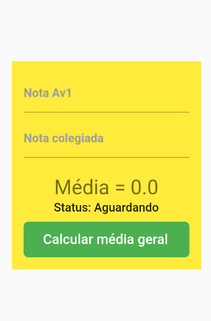

# CalculadoraMediaUninassau-Flutter
 Aplicativo de calculadora de média da faculdade uninassau

Instalação

 <ul>
    <li>Necessário ter o flutter instalado no computador</li>
    <li>Clonar este repositório</li>
    <li>Importar o projeto para sua pasta de projetos</li>
    <li>Executar no emulador de sua preferência</li>   
</ul>

